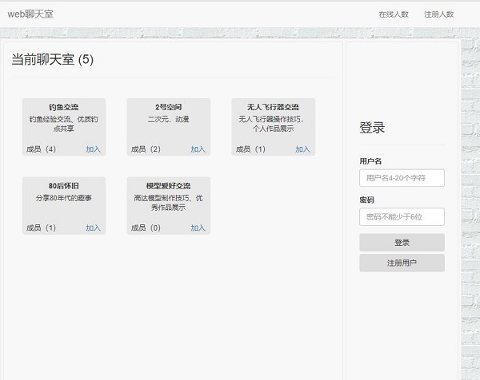

# Django-webchat
- 使用django-channels实现的在线聊天室

## 技术栈
- 前端：Bootstrap
- 后端：框架使用django 2.1.5，websocket用django-channels 2.1.6实现，数据保存在mysql中，
    使用redis保存在线用户信息

------
## 实现功能
- 用户登录注册、个人介绍编辑

- 创建聊天房间

- 添加好友和房间

    
- 房间群聊

- 好友聊天

- 未读消息提醒

    

